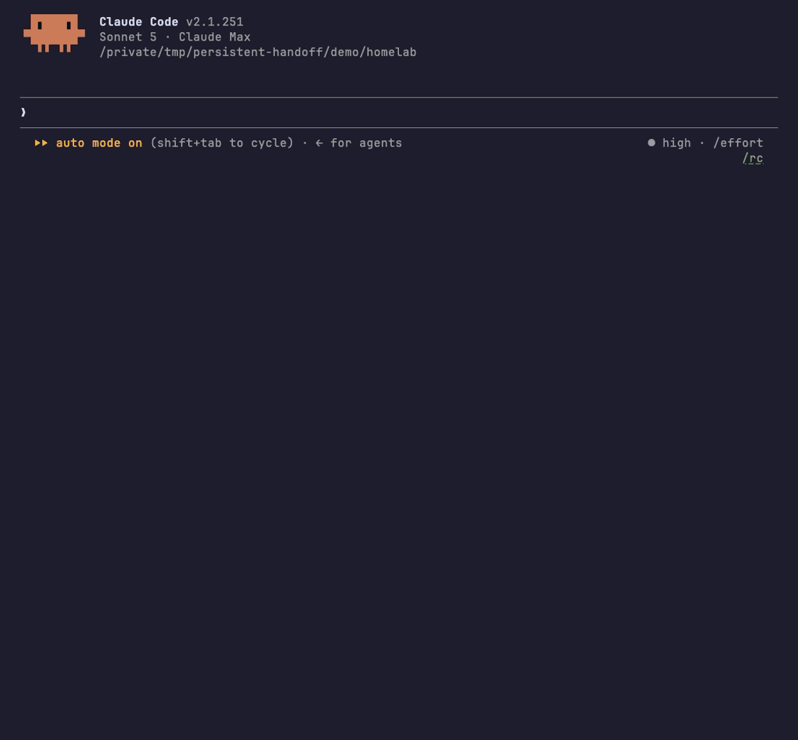

# persistent-handoff

[](https://github.com/adrrr/persistent-handoff/actions/workflows/tests.yml)
[](https://github.com/adrrr/persistent-handoff/releases)

Your agent starts every session knowing where the work stands. It keeps one handoff file, rewrites it at milestones, and a `SessionStart` hook reads it back before your first message.



*The agent rewrites its handoff, exits, and a new session answers `where were we?` from that file. The one `Read` on screen is the log the handoff points at.*

I run eight Claude Code sessions in tmux. A cron restarts the idle ones every night, and they used to wake up blank. Some now restart themselves when their context gets heavy. They update the handoff, kill their own tmux session, and the new one picks up from the file.

It's for agents that keep running, an assistant up for six months or a daemon on a cron. They get their messages through `claude --channels` (Telegram, Discord, iMessage…) or Remote Control from the Claude app, so a restart, a crash or a compact on the machine goes unnoticed on your side. Without the handoff, your next message is you explaining what it was doing. Nothing in the plugin depends on tmux or channels.

[Example](#what-one-looks-like) · [Install](#install) · [Try it](#try-it) · [Contract](#the-contract) · [FAQ](#faq) · [Related](#related)

## What one looks like

```markdown
# Handoff: homelab

## Where I am
The nightly restic backup to the NAS failed every night from Aug 25 to Aug 27.
Cause found: restic is fine, the SMB mount drops when the router hands the NAS a
new DHCP lease. Address pinned to 192.168.1.40 in the router config on Aug 27.
Two clean runs since (Aug 28, Aug 29), which is not enough to call it fixed.

## Next action
Read logs/restic-nightly.log after tonight's 23:40 run. Three consecutive clean
runs close this. Anything else means the mount was not the whole story.

## Open questions
Whether the daily snapshots from before Aug 25 get pruned or kept for the year.
Asked Aug 28, no answer yet. Blocks nothing until the disk passes 80% (61% today).

## Traps
- The restic password is in the keychain, not in the environment:
  `security find-generic-password -s restic-nas -w`
- `restic check` on this repo takes about 25 minutes. Never in a foreground turn.
- The NAS answers ping after its SMB share is already gone. Ping is not a health
  check here, `mount | grep nas` is.

## Skills to invoke on resume
systematic-debugging, if tonight's run fails again.
```

The demo's handoff. `./demo/setup.sh` puts it in a project you can open. 300 to 500 tokens is the useful range, shorter hides a vague next action and longer is a journal.

## Install

```bash
claude plugin marketplace add adrrr/persistent-handoff && claude plugin install persistent-handoff@persistent-handoff
```

The repo is its own plugin marketplace, so that one command adds it, installs the plugin and wires the `SessionStart` hook. Needs Claude Code 2.1.69 or newer (tested on 2.1.251, [details](docs/INSTALL.md#claude-code-version)) and `bash` on `PATH`. [Windows](docs/INSTALL.md#windows): WSL, or [Git for Windows](https://git-scm.com/downloads/win) installed first. [`docs/INSTALL.md`](docs/INSTALL.md) has the in-session commands, uninstall, the hand install and the 0.1.0 upgrade note. Nothing happens until a handoff exists, the hook is silent when the file is missing or blank.

## Try it

The demo is a fictional homelab project with a real handoff in it. Clone it, install the hook, talk to the agent:

```bash
git clone https://github.com/adrrr/persistent-handoff && cd persistent-handoff
./demo/setup.sh && cd demo/homelab
claude --model claude-sonnet-5 --setting-sources project,local --strict-mcp-config --tools Read,Glob,Grep,Skill,Write
```

Those are the flags the GIF used. They load only the demo's settings and no MCP server. `Write` isn't scoped to one file, so keep the session to the demo project. Claude Code asks you to trust the folder. The demo carries a project hook and the handoff it feeds is input the agent acts on, so read [`hooks/session-start-handoff.sh`](hooks/session-start-handoff.sh) first ([trust boundary](docs/REFERENCE.md#the-handoff-is-input-the-agent-acts-on)). Say `Keep the daily snapshots for the year, that's decided. I'm going to restart you in a minute.` The skill rewrites `.claude/handoff.md`. `/exit`, run the same command, ask `where were we?`. The answer comes from the hook, not from a file the agent opened. `git checkout -- demo/homelab/.claude/handoff.md` resets it.

## The contract

1. One file, always the same one, never two.
2. Read automatically at every session start. A file a human has to load by hand gets forgotten on the session where it mattered.
3. The agent writes it at milestones, unprompted. A decision, a PR opened or merged, an investigation concluded, a blocker, a question left with a human. Not after every message.
4. Four sections, plus a fifth when it applies. Where I am, next action, open questions, traps, and the skills the next session should load.
5. Every update removes what's resolved.
6. Empty is fine. When nothing is in flight, the file gets deleted.

## Where the handoff lives

An agent in `/home/alice/work/acme/api` reads `~/.claude/handoffs/work-acme-api-32817b.md` by default. That name is the working directory relative to your home, separators turned into dashes, and a short digest of the full path on the end. `session-start-handoff.sh --path` prints it for the directory you run it in.

An agent not tied to one directory pins `PERSISTENT_HANDOFF_FILE` to an absolute path. [`docs/REFERENCE.md`](docs/REFERENCE.md) covers the expansion trap in doing that, what the digest does and doesn't guarantee, several sessions on one path, and Claude Code's 10,000 character cap on hook output.

## FAQ

**Why not just use `/compact`?** The compaction summary dies with the session that holds it. The file survives a crash, a `kill -9` and a reboot, none of which give the model a chance to summarize anything. Compaction keeps what the model judged worth keeping. The handoff keeps what you decided matters. Use both.

**What happens after a compact or a resume?** The hook fires there too, about 500 tokens, so the handoff is present whatever the summary kept. The preamble says your context wins for what you did in this session and the file for everything else. If they disagree, update the file. Repeated resumes don't stack copies ([`docs/REFERENCE.md`](docs/REFERENCE.md#repeated-resumes-do-not-stack-copies)).

**Why delete the file when it's empty?** Every session start reads it. A file that's always there, half stale, teaches every new session to skim it. If it exists, something is in flight. An agent whose work never ends prunes every update instead.

**Why not just keep this in CLAUDE.md or the agent's memory?** Different lifetimes. CLAUDE.md and memory hold mechanisms, commands and preferences. The handoff holds what's in flight, and gets deleted when it lands.

**My agent is a coding session I close at the end of the day. Do I want this?** Probably not. Persistence buys nothing when the agent dies on purpose after one task. Use a disposable handoff instead.

**I deleted the project. Is its handoff still there?** Yes. Nothing prunes `~/.claude/handoffs/`. The hook puts no date in the preamble, so date the content the way the example does.

**What does it cost on every session start?** 10 to 25 ms. Zero tokens when no handoff exists, 400 to 600 with one.

## Related

Many handoff skills exist for Claude Code. This one keeps a single file, rewritten in place and deleted when nothing is in flight. The others write a new snapshot each time.

- [Matt Pocock's `handoff`](https://github.com/mattpocock/skills/blob/main/skills/productivity/handoff/SKILL.md) writes to the OS temp directory, once, on a manual invocation. Disposable, and the right tool for a session you'll close today. The disposable pattern and the idea of naming the skills the next agent should load come from [his skills repo](https://github.com/mattpocock/skills) (MIT). No code from it is reused here.
- [Sting25/claude-code-handoff](https://github.com/Sting25/claude-code-handoff) is the closest on mechanism, one file per repo, loaded at startup, with a nudge when the context fills. It keeps the last five handoffs as history.
- [blader/baton](https://github.com/blader/baton) has you drop and grab a baton by hand, into timestamped files under `.baton/`, and works with Codex as well as Claude Code. Manual on both ends, one file per session.
- [REMvisual/claude-handoff](https://github.com/REMvisual/claude-handoff) mines the conversation on a `/handoff` command and chains the results in sequence. You paste the result into the next session.
- [rupaut98/unforget](https://github.com/rupaut98/unforget) hooks `SessionStart` on compaction only and digests the transcript JSONL itself. Extracted automatically instead of written by the agent.

## Tests

`bash tests/hook.sh`: 37 cases on the hook's failure modes and its two preambles. `bash tests/manifests.sh`: 14 cases pinning the plugin manifests and holding the `SessionStart` block to one shape in its three copies (plugin, demo, hand-install snippet in [`docs/INSTALL.md`](docs/INSTALL.md)).

[CI](.github/workflows/tests.yml) runs both on Ubuntu, macOS and Windows, on every pull request, every push to `main` and on demand. 51 assertions per OS, minus three on Windows where NTFS won't stage a `chmod 000` that denies a read, a `chmod 555` directory or a dangling symlink (the suite prints how many it skipped). The same workflow runs `./demo/setup.sh`, calls the installed hook the way the demo's `settings.json` does, and runs `shellcheck` on the Linux leg.

## License

MIT
