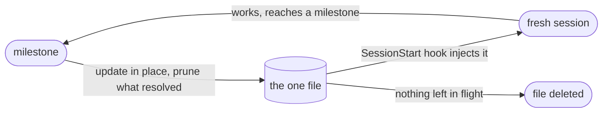

# persistent-handoff

[](https://github.com/adrrr/persistent-handoff/actions/workflows/tests.yml)


`/clear` wipes the context, the `SessionStart` hook puts the handoff back, and the next question is answered from where the work stands.

Your agent keeps one file, always the same one. It updates it at milestones, reads it back automatically at every session start, and drops from it whatever it has resolved. This is for agents that keep running: a personal assistant that has been up for six months, a fleet of Claude Code sessions in tmux, a daemon that wakes on a cron. Their context dies often and rarely with a warning.

## Install

The repo is its own plugin marketplace. One command adds it and installs the plugin, and the `SessionStart` hook is wired for you.

```bash
claude plugin marketplace add adrrr/persistent-handoff && claude plugin install persistent-handoff@persistent-handoff
```

Inside a running session, the two slash commands do the same thing:

```
/plugin marketplace add adrrr/persistent-handoff
/plugin install persistent-handoff@persistent-handoff
```

Start a new session and both the skill and the hook are live. Remove it with `claude plugin uninstall persistent-handoff@persistent-handoff`. If you would rather not use plugins, [install it by hand](#install-by-hand).

Upgrading from 0.1.0? The derived filename gained a digest, so the hook will not find your existing handoff. Run `--path` in the directory and rename the file to what it prints, or pin `PERSISTENT_HANDOFF_FILE` to the old path. Nothing warns you otherwise: the hook reads the new name, finds nothing, and stays silent.

Coming from the hand install? Remove the `SessionStart` entry from your `settings.json` and delete `~/.claude/skills/persistent-handoff/`. The plugin's hook and the hand-wired one are separate handlers, so keeping both injects the handoff twice at every session start.

The hook is plain portable bash, with no BSD-only flags. `jq` is optional and there is a plain-text fallback when it is missing.

### Windows

WSL is the recommended path. Claude Code inside WSL is a Linux environment, so everything here applies unchanged.

On native Windows, Claude Code runs a `command` hook through Git Bash when [Git for Windows](https://git-scm.com/downloads/win) is installed, and through PowerShell when it is not. Install Git for Windows first. Without it the hook lands in PowerShell, which will not run a bash script.

The test suite runs on `windows-latest` through Git Bash on every pull request, which is the same interpreter. Two of the 32 hook cases skip there, because NTFS will not stage the scenario they need: a `chmod 000` that actually denies a read, and a dangling symlink. Both are about how the hook reports a broken handoff, not about whether it reads a good one.

## Try it

The demo is a fictional homelab project with a real handoff in it. Clone, install the hook into it, and ask the agent where things stand:

```bash
git clone https://github.com/adrrr/persistent-handoff && cd persistent-handoff
./demo/setup.sh && cd demo/homelab
claude --model claude-sonnet-5 --setting-sources project,local --strict-mcp-config --tools Read,Glob,Grep
```

Then ask `where were we?`. Those are the flags the GIF was recorded with. They load only the demo's own settings and leave the session read-only.

Claude Code will ask you to trust the folder, because the demo carries a project hook. The prompt preselects the option that exits, and it is right to be careful: a handoff is executable input. Read [`hooks/session-start-handoff.sh`](hooks/session-start-handoff.sh) first. [One caution about where you put it](#one-caution-about-where-you-put-it) explains why the demo is the only place in this repo that commits a handoff to a project.

## Disposable handoff, persistent handoff

The usual handoff is deliberately throwaway. At a crossing you write a markdown file somewhere temporary, and its job ends once the next session has read it. [Matt Pocock's `handoff` skill](https://github.com/mattpocock/skills/blob/main/skills/productivity/handoff/SKILL.md) says it plainly: "Save to the temporary directory of the user's OS - not the current workspace." For a coding session you will close today, that is the right call. Use it.

This repo makes the opposite bet on lifetime. Every row below follows from that one choice.

| | Disposable | Persistent |
|---|---|---|
| Location | a temp directory | `~/.claude/handoffs/<agent>.md` or the project repo |
| How many | a new file each time | the same file, updated |
| Read back | you hand it to the next session | a `SessionStart` hook, every session, automatically |
| Written | once, at a crossing | at milestones, as the work advances |
| Lifetime | until the next session picks it up | until the work it describes is done |
| Deleted | when the OS clears its temp files | by the agent, the moment it is empty |

The second row is the important one. A disposable handoff is an event, so having ten of them is normal. A persistent handoff is a state, so having two is a bug: the next session reads the stale one and acts on work that finished last week.

## The loop



The loop runs until the work is done, and then the file is gone.

For an agent that never runs out of work, that last step never comes. A six-month-old assistant always has something in flight, so its file never disappears. Expect that. What keeps such a file worth reading is the pruning: every update drops what resolved, so it only ever describes today's work. That is what keeps it short.

Deletion is that same rule at its limit, and it is what a project that ends does with its handoff. The rule to hold on to is the pruning.

## The contract

1. One file, always the same one, never two. A state has one current value.
2. It is read automatically at every session start. If a human has to remember to load it, it will be forgotten on the session where it mattered.
3. It is written at milestones, by the agent, unprompted: a decision made, a PR opened or merged, an investigation concluded, a blocker hit, a question left with a human. Not after every message.
4. Four sections, plus a fifth when it applies. Where I am, next action, open questions, traps, and the skills the next session should load.
5. Every update removes what is resolved. A handoff that only grows stops being read.
6. Emptiness is legitimate. When nothing is left in flight, the file is deleted.

Point 6 is the first one people drop, and the FAQ says why it matters.

## What one looks like

```markdown
# Handoff: homelab

## Where I am
The nightly restic backup to the NAS failed every night from Aug 25 to Aug 27.
Cause found: restic is fine, the SMB mount drops when the router hands the NAS a
new DHCP lease. Address pinned to 192.168.1.40 in the router config on Aug 27.
Two clean runs since (Aug 28, Aug 29), which is not enough to call it fixed.

## Next action
Read logs/restic-nightly.log after tonight's 23:40 run. Three consecutive clean
runs close this. Anything else means the mount was not the whole story.

## Open questions
Whether the daily snapshots from before Aug 25 get pruned or kept for the year.
Asked Aug 28, no answer yet. Blocks nothing until the disk passes 80% (61% today).

## Traps
- The restic password is in the keychain, not in the environment:
  `security find-generic-password -s restic-nas -w`
- `restic check` on this repo takes about 25 minutes. Never in a foreground turn.
- The NAS answers ping after its SMB share is already gone. Ping is not a health
  check here, `mount | grep nas` is.

## Skills to invoke on resume
systematic-debugging, if tonight's run fails again.
```

That is the demo's handoff, and `./demo/setup.sh` puts it in a project you can open.

Around 300 to 500 tokens is the useful range. Below that you are usually hiding a vague next action. Above it you are writing the journal.

## Where the handoff lives

By default the hook names the file after the working directory, relative to your home directory, with the separators turned into dashes and a short digest of the full path on the end. An agent running in `/home/alice/work/acme/api` reads `~/.claude/handoffs/work-acme-api-32817b.md`.

Two halves, two jobs. The dashed part lets you read the directory off the filename. The six hex characters carry what the dashed part loses: without them `~/my project` and `~/my-project` are one file, and so are `~/abs/var/tmp/x` and `/var/tmp/x`. The digest covers the absolute path, so yours will not match the example above.

Twenty-four bits is not a uniqueness proof. It makes a clash a coincidence rather than a certainty, and it only has to hold between directories that already slug to the same string, which is a much smaller set than every directory you work in. A `cksum` collision can also be constructed on purpose by anyone who wants one. If you need a guarantee rather than a good bet, pin `PERSISTENT_HANDOFF_FILE`.

The digest needs `cksum`, which is POSIX and present everywhere this is tested. Without it the name falls back to the dashed part alone, which is the lossy 0.1.0 behaviour. The hook says so on stderr when that happens, and stderr from a hook lands in Claude Code's debug log.

Using the whole path rather than the last segment keeps `~/work/beta/api` from sharing a file with every other directory called `api`.

To see the name for a directory rather than work it out, ask the hook:

```bash
~/.claude/hooks/session-start-handoff.sh --path
```

That is how the skill tells the agent to find the path before its first write. After that, the hook names the path in the line it injects above the content.

For an agent that is not tied to one directory, pin the path instead. The hook reads `PERSISTENT_HANDOFF_FILE`, and the place to set it is the `env` block of the same `settings.json`:

```json
{
  "env": {
    "PERSISTENT_HANDOFF_FILE": "${CLAUDE_PROJECT_DIR}/.claude/handoff.md"
  }
}
```

That applies to the whole session, so the hook and the agent's own shell see the same value. It matters because the agent works the path out by itself the first time it writes, before any handoff exists for the hook to name.

Write an absolute path there. `${CLAUDE_PROJECT_DIR}` is expanded in a hook's `command` string but not inside the `env` block, so a path using it there arrives at the hook literally and the hook finds no file.

For a path that has to follow the project rather than sit at a fixed location, set the variable inline in the hook command instead, where the expansion does happen. This is what the demo does:

```json
"command": "PERSISTENT_HANDOFF_FILE=\"${CLAUDE_PROJECT_DIR}\"/.claude/handoff.md \"${CLAUDE_PROJECT_DIR}\"/.claude/hooks/session-start-handoff.sh"
```

That form sets the variable for the hook only. The agent never sees it, so it writes its first handoff to the derived path while the hook keeps reading the pinned one, silently, forever. Use it only when you tell the agent outright where its handoff lives, which is why the demo's own handoff is named in its README. Exporting the variable from your shell profile, or from the launchd or systemd unit that starts the agent, avoids the problem the same way the `env` block does.

Nothing happens until a handoff exists. The hook stays silent when the file is missing or holds nothing but whitespace, so installing it costs nothing on sessions with no state to carry.

## The 10,000 character cap

Claude Code caps a hook's output at 10,000 characters. Past that it saves the text to a file and injects a truncated preview plus the path instead of the content. This is Claude Code's limit rather than this repo's, so it can move in a future release with nothing to warn you, and the exact preview size is its business too.

The cap counts everything the hook emits. The preamble is 261 fixed characters plus the handoff's own path, so call it 330 and the file's budget is about 9,670. A handoff kept to the 300 to 500 tokens the skill asks for sits far below that. One grown into a journal arrives as a preview instead, which is one more reason to prune.

## FAQ

**Why not just use `/compact`?**

Compaction summarizes the transcript, and the model decides what survives. A handoff records what you decided matters, in your words. It is a file, so it survives a crash, a `kill -9` and a reboot, none of which give the model a chance to summarize anything. Use both.

**Why delete the file when it is empty?**

Because it is read at every single session start. A handoff that is always present, half stale, describing work that finished last week, teaches every new session to skim it. Deleting it keeps the file meaningful: if it is there, something is genuinely in flight. For an agent whose work never ends, the same job is done by pruning every update.

**Why not just keep this in CLAUDE.md or the agent's memory?**

Different lifetimes. CLAUDE.md and memory hold what stays true: mechanisms, commands, preferences. The handoff holds what is in flight right now, and gets deleted when it lands. Put a stable fact in the handoff and it dies with the work. Put the current blocker in memory and it outlives its own resolution.

**I run three sessions in the same repo. Will they clobber each other?**

They will. By this design, three sessions in one directory are one agent, and the last writer wins. The skill asks for write-to-temp-then-move, which prevents a torn read but not a lost update. If your sessions hold genuinely separate work, pin `PERSISTENT_HANDOFF_FILE` per session. There is no locking, and at this size there should not be.

**What does it cost on every session start?**

One process spawn, about 13 ms with `jq`. Zero tokens when no handoff exists, which is the normal case. With one, roughly 400 to 600 tokens.

**My agent is a coding session I close at the end of the day. Do I want this?**

Probably not. Persistence buys you nothing when the agent dies on purpose after one task, and the bookkeeping is real work. Use a disposable handoff instead.

## Install by hand

Copy the skill and the hook, then wire the hook into your settings.

```bash
src=$(mktemp -d) && git clone https://github.com/adrrr/persistent-handoff "$src"
mkdir -p ~/.claude/skills/persistent-handoff ~/.claude/hooks ~/.claude/handoffs
cp -r "$src"/skills/persistent-handoff/. ~/.claude/skills/persistent-handoff/
install -m 755 "$src"/hooks/session-start-handoff.sh ~/.claude/hooks/
```

The `cp` copies the contents rather than the directory, so running the install twice updates the skill instead of nesting a copy inside it.

Then add the hook to `~/.claude/settings.json`, or to a project `.claude/settings.json`:

```json
{
  "hooks": {
    "SessionStart": [
      {
        "hooks": [
          {
            "type": "command",
            "command": "\"$HOME\"/.claude/hooks/session-start-handoff.sh",
            "timeout": 10
          }
        ]
      }
    ]
  }
}
```

There is no `matcher`, so the hook runs on every kind of start: `startup`, `resume`, `clear`, `compact` and `fork`. Firing after a compact is the point rather than an accident. That is the moment the session has just lost the detail the handoff carries.

## One caution about where you put it

The hook feeds the handoff straight into a fresh session as context, and the file tells that session what to do next. Treat it as executable input.

That is fine for `~/.claude/handoffs`, which only you write to. It deserves a second thought inside a repo. A handoff committed to a project means anyone who can push to that project can write text that lands in your agent's context the next time you open a session there. Keep a versioned handoff to repos whose writers you trust, and use the home directory for anything else.

The same reasoning is why Claude Code asks you to trust a folder that carries a project hook, and why this repo's demo, which is exactly the committed-handoff pattern, tells you to read the hook first.

## Related

Handoff files for Claude Code are a crowded shelf. What is specific here is the contract: one canonical file, rewritten in place, deleted when nothing is in flight. The neighbours keep history instead.

- [Matt Pocock's `handoff`](https://github.com/mattpocock/skills/blob/main/skills/productivity/handoff/SKILL.md) writes to the OS temp directory, once, on a manual invocation. Disposable by design. The table above compares with it rather than argues against it.
- [Sting25/claude-code-handoff](https://github.com/Sting25/claude-code-handoff) is the closest on mechanism: one file per repo, loaded at startup, with a nudge when the context fills. It keeps the last five handoffs as history, where this one keeps a single current state.
- [blader/baton](https://github.com/blader/baton) has you drop and grab a baton by hand, into timestamped files under `.baton/`, and works with Codex as well as Claude Code. Manual on both ends, one file per session.
- [REMvisual/claude-handoff](https://github.com/REMvisual/claude-handoff) mines the conversation on a `/handoff` command and chains the results in sequence. You paste the result into the next session.
- [rupaut98/unforget](https://github.com/rupaut98/unforget) hooks `SessionStart` on compaction only and digests the transcript JSONL itself. It is the opposite mechanism: extracted automatically rather than written by the agent.

Want an agent to record what it decided? This repo. Want a record of how it got there? Most of the others fit better.

## Credits

The disposable handoff pattern comes from [Matt Pocock's skills repo](https://github.com/mattpocock/skills) (MIT), and so does the idea of naming the skills the next agent should load: "Include a 'suggested skills' section in the document, naming which skills the next agent should call the Skill tool for." No code from it is reused here. The credit is for the ideas.

The disagreement is about one choice, the lifetime, and we aim at different kinds of agent. His repo also carries an in-progress `claude-handoff` skill that turns a handoff into a background agent's prompt without saving it anywhere. A third lifetime, shorter still.

## Tests

`bash tests/hook.sh`, 32 cases covering the hook's failure modes: path-slug collisions inside and outside `$HOME`, a `$HOME` containing glob metacharacters, a `jq` that exists but fails, a directory where the file should be, a dangling symlink, unreadable handoffs surfaced to the session instead of swallowed, a 2 MB handoff still emitting valid JSON, and the fallback taken when no `cksum` is available.

`bash tests/manifests.sh`, 11 cases pinning the plugin manifests: valid JSON, the plugin root variable in the hook command, the script's exec bit, no matcher on `SessionStart`, the two names the install id is built from, the skill's location, and the changelog agreeing with the shipped version.

Both run on `ubuntu-latest`, `macos-latest` and `windows-latest` on every pull request: 43 assertions each, minus the two the Windows section explains. A skipped case asserted nothing, so the suite prints how many it skipped alongside the pass. See [`.github/workflows/tests.yml`](.github/workflows/tests.yml).

## License

MIT
